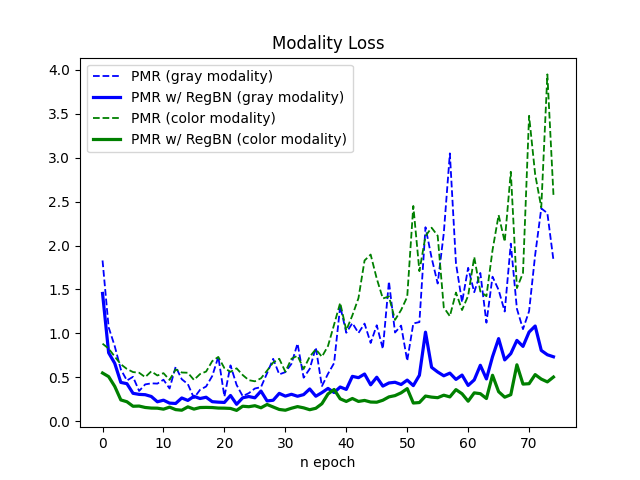

<p align="center">
    <h1>
        <strong>
            RegBN: A Normalisation Method for  Multimodal Data 
        </strong>
    </h1>
</p>

<p align="center">
<p align="center" width="100%">
    
</p>

This repository is the official implementation of **[RegBN: Batch Normalization of Multimodal Data with Regularization](https://arxiv.org/abs/2310.00641#:~:text=This%20paper%20introduces%20a%20novel,dependencies%20among%20different%20data%20sources.)**

A NeurIPS 2023 Paper ([link](https://neurips.cc/virtual/2023/poster/70500))

Project ([link](https://mogvision.github.io/RegBN/))

RegBN facilitates the training of deep multimodal models while ensuring the
prediction of reliable results with the following features:
* As a normalization module, RegBN can be integrated into multimodal models of any
architecture such as multilayer perceptrons (MLPs), convolutional neural networks (CNNs),
vision transformers (ViTs), and other architectures.
* It possesses the capability to be applied to a vast array of heterogeneous data types,
encompassing text, tabular, audio, image, video, depth, and 3D MRI.
* It can be applied to any data/feature structure, removing dependency and confusing effects in your models!


#### An example

Here, RegBN is employed in [PMR](https://openaccess.thecvf.com/content/CVPR2023/papers/Fan_PMR_Prototypical_Modal_Rebalance_for_Multimodal_Learning_CVPR_2023_paper.pdf) as an example method, designed to address the "modality imbalance" issue and enhance the overall performance of Multimodal Learning (MML).

<p float="center">
   
   > 
</p>

> RegBN eliminates confounders and dependencies among multimodal data, enabling an MML model to converge more effectively!

RegBN code does not contain any extra modules and can be directly used in a standard torch model:

#### Python　

```python
import torch
device = "cuda"

batchSize = 50
f = torch.rand([batchSize, 512])
g= torch.rand([batchSize,  64, 7, 7])

kwargs = {
        'gpu': 0,
        'f_num_channels': 512, 
        'g_num_channels': 64,
        'f_layer_dim': [],
        'g_layer_dim':[7, 7],
        'normalize_input': True,
        'normalize_output': True,
        'affine': True,
        'sigma_THR': 0.0, 
        'sigma_MIN': 0.0, 
}

regbn_module = RegBN(**kwargs).to(device)
print(regbn_module)

# during training
epoch = 10
steps_per_epoch = 100 # number of batches, len(dataloader)
kwargs_train = {"is_training": True, 'n_epoch': epoch, 'steps_per_epoch': steps_per_epoch}
f_norm, g_norm = regbn_module(f, g, **kwargs_train) 
print(f_norm.shape, g_norm.shape)

# during inference/eval
kwargs_infer = {"is_training": False}
f_norm, g_norm = regbn_module(f, g, **kwargs_infer) 
print(f_norm.shape, g_norm.shape)
```

#### Run example code
Download the colored-MNIST from this [link](https://drive.google.com/file/d/11K-GmFD5cg3_KTtyBRkj9VBEnHl-hx_Q/view) and then locate it at 'example_PMR/data/Mnist/colored_mnist/'

```bash
# w/o RegBN
cd example_PMR
python PMR.py --epochs 75 --learning_rate 0.001  --gpu 0 --train  --batch_size 50  --optimizer Adam 

# with RegBN
python PMR.py --epochs 75 --learning_rate 0.001  --gpu 0 --train  --batch_size 50  --optimizer Adam  --regbn
```


#### Few Points
* RegBN, as a multimodal normalization method, can be employed with various types of feature maps. Simply specify the size and feature dimensions in the input.
*  RegBN can be employed as long as its inputs are not mutually independent.
* To optimize the performance of RegBN, it's advisable to choose a sensible number of channels. For instance, using feature maps with 512 channels for raw MNIST data of size [28, 28] may be considered impractical (Singularity thread!).
* Presently, RegBN is designed to work with a single GPU. This is due to the `torch.optim.LBFGS` which do not support multiple GPUS right now.
* RegBN, like other normalization techniques, can be used multiple times in neural networks. RegBN acts as an independence-promoting layer, so utilizing it multiple times in a row does not substantially alter the feature maps. For a pair of modalities, it is advised to employ RegBN once as a multimodal normalizer within various fusion paradigms. 
* It is important to highlight that in the context of layer fusion (Figure 4c), where RegBN is employed multiple times, the input feature maps at each instance differ from one another.

#### RegBN vs. MML Fusion models
RegBN functions by normalizing input X in relation to input Y, resulting in a
normalized X with the same dimensions as the original input X. In fusion, inputs X and Y are
combined to generate one or more outputs with distinct content and dimensions. RegBN can be
used as a normalization method within the structure of any fusion or neural network. It would be intriguing to revisit the performance of fusion methods in the presence of RegBN.


_______
## Citation

If you use RegBN for your research, please cite the following work:

```bibtex
@inproceedings{ghahremani2023regbn,
  title={RegBN: Batch Normalization of Multimodal Data with Regularization},
  author={Ghahremani, Morteza and Wachinger, Christian},
  booktitle={Thirty-seventh Conference on Neural Information Processing Systems (NeurIPS 2023)},
  year={2023}
}
```

### Acknowledgements
The example PMR code  is built upon [PMR](https://github.com/fanyunfeng-bit/Modal-Imbalance-PMR). Please refer to official webpage of the technique for more details. 
